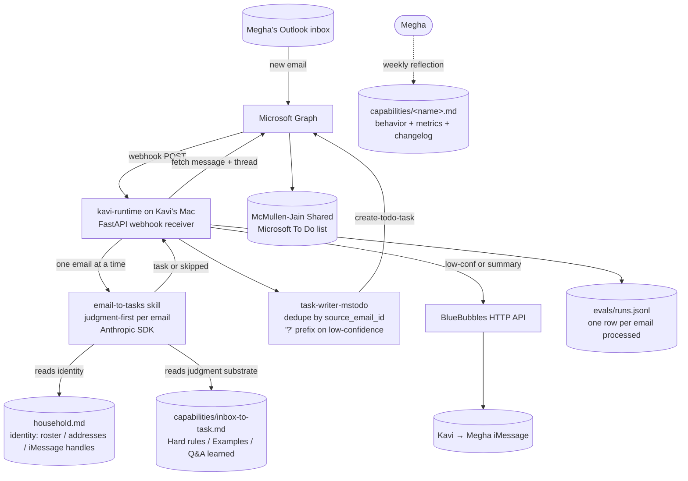

# HomeOS Architecture

HomeOS is a personal home-automation project that turns Megha's Outlook inbox into action items in the shared "McMullen-Jain Shared" Microsoft To Do list. The realtime Kavi runtime on Kavi's Mac (`kavi-runtime/`) is the sole trigger: MS Graph webhooks fire on each new email; the runtime calls the `email-to-tasks` skill via Anthropic SDK to decide whether to create a task; a `task-writer-mstodo` adapter writes approved tasks via MS Graph. The same loop is the foundation for the Chief of Staff role being onboarded in stages.

## Diagram

## Legend

- **Solid arrow** is runtime data flow per email (webhook → judgment → MS To Do).
- **Dotted arrow** is a human writing practice, not automation.
- **Cylinder shape** is durable storage (a file, a list, or a mailbox).
- **`'?'`**** prefix** is the literal `[?]` Megha sees in MS To Do when a task came back with `confidence: low`. It is her one-glance signal to triage on her phone.
- **Microsoft Graph** is the single boundary for email + tasks. The runtime uses the MS Graph SDK directly (Python).

## What is NOT yet built

These are part of the active Chief of Staff plan (`capabilities/kavi-persona.md`, `capabilities/realtime-kavi.md`) but not yet wired in.

- **iMessage send and receive via BlueBubbles.** Step 1 of Chief of Staff onboarding. Needs an always-on Mac (TBD) signed into **Kavi's** Apple ID (`kavi@example.com`), plus the BlueBubbles server installed on it. (Kavi is the household's named Chief of Staff, 2026-04-27.)
- **Q&A learned-pattern loop.** When `email-to-tasks` returns `confidence: low`, the orchestrator will iMessage Megha a yes/no question. Her reply will append to the "Q&A learned patterns" subsection of `capabilities/inbox-to-task.md` Behavior section. Today the orchestrator only writes the `[?]` task; the Q&A channel does not exist yet.
- **Max's inbox.** Step 2 of Chief of Staff onboarding. Today only Megha's Outlook is read.
- **Privacy / sender-block filter.** Roadmap v1. Today there is no filter; the prompt is trusted to skip non-actionable email.
- **`email-reader`**** subagent.** The original v0 plan specified one for context isolation. The current orchestrator calls `email-to-tasks` directly per email. Decision logged in `capabilities/inbox-to-task.md` changelog (2026-04-25 entry); revisit if a single run exceeds the $0.30 token budget.

## What happens when Megha or Max sends Kavi an iMessage

Walk-through of one inbound, plain-language first, with the code function name in italics. Worked example: "Mark all elders tea items done."

**1. The iMessage arrives at Kavi's Mac.** BlueBubbles (the iMessage bridge running on Kavi's MacBook) catches the inbound and POSTs it to the runtime's HTTP endpoint. The handler logs the inbound to `eval-persona-inbound.jsonl` so it's visible later in evals.
*Code: `handlers.py` → `imessage_received()` is the entry point.*

**2. Kavi asks himself: "Is this person pushing back on something I did wrong recently?"** First LLM call on every inbound. The model reads the new message + Kavi's recent outbound and answers "this is a correction" or "this is something new." If correction: separate apology/adjust path. If not: continue.
*Code: `claude_client.classify_correction()`. Why it exists: without this, "no, that's wrong" gets misread as a brand-new task request.*

**3. Kavi asks: "Is this a task command, a coordination ask, or just chat?"** Two LLM classifiers run (often parallel):
- `classify_action_intent()` — returns intent like `mark_done` or `create_task`, plus a target string ("Oak Circle Tea") and confidence
- `classify_coordination_intent()` — returns whether this is asking for cross-household coordination with Max
*Why two: chat / task command / coordination are entirely different downstream flows.*

**4. (Task-command branch) Kavi pulls all open tasks from MS To Do.** Just a Microsoft Graph API call. Not LLM. Deterministic fetch with a server-side status filter so completed tasks never crowd open ones off the slate.
*Code: Graph `/me/todo/lists/.../tasks?$filter=status eq 'notStarted' or status eq 'inProgress'&$top=100&$orderby=lastModifiedDateTime+desc`.*
*Why this shape: open-task count is typically <100 in this household. The earlier recency-only top=30 cap dropped older open tasks off on busy days when mass-completions pushed them past position 30 (2026-05-08 Oak Circle Tea trace).*

**5. Kavi asks: "Which of these tasks does the user mean?"** LLM call. Given the target string + open-task titles, the model picks one or more matches with confidence. **This is the actual matching layer.** It handles apostrophes, abbreviations, paraphrases — exactly what LLMs are good at.
*Code: `claude_client.match_target_to_open_task()`. Why it exists: users say "Oak Circle Tea" but the task title is "MJ Forward Oak Circle Tea Zoom link to your guest". The LLM bridges rough → specific.*

**6. Kavi branches based on the matcher's answer.**
- One clear high-confidence match: call MS Graph PATCH to mark complete; send confirmation iMessage.
- Multiple matches OR low confidence: save a "pending question" to disk and ask a clarifying question.
- No match: tell the user he couldn't find it.
*Code: branching in `handlers.py` → `_try_handle_action_intent()`.*

**7. (Multiple-match branch) Kavi composes the clarifying question.** LLM call. Given the candidate matches, the model writes the question in Kavi's voice ("Found 4 Oak Circle Tea tasks: [list]. Mark all four?"). Sent via BlueBubbles.
*Code: `claude_client.compose_action_clarifying_reply()`. Why it's an LLM call (not a template): kavi-persona Principle 7 — every user-facing line is LLM-composed so it sounds natural.*

**8. Kavi waits. The user replies "Yes" / "Yea" / "all four" / "just the Zoom one" / "skip."** New inbound arrives; steps 1-3 fire again.

**9. Kavi reads the pending question from disk: "Did the user confirm, reject, or pick a subset?"** LLM call. The model gets the user's reply + the saved candidate list and decides what to act on.
*Code: state stored in `imessage_state.json` under `pending_action_clarifications`. Resolved by `claude_client.resolve_pending_action_clarification()`.*

**10. Kavi executes the actions and sends a confirmation reply.** For each task to mark done: MS Graph PATCH call. Then another LLM call composes the confirmation reply that names exactly what got done.
*Code: `claude_client.compose_batch_action_reply()`.*

**11. Before any composed iMessage goes out, structural checks run.** Separate rules look at the composed text:
- G-V1: under 120 chars?
- G-A1: does the message claim "marked done" without a verified tool result behind it? (the hallucination check)
- Several voice/style rules.

If certain rules fail on certain message kinds, the message is dropped and replaced with "I caught myself about to claim that as done…" Other failures just log.
*Code: `structural_checks.py` → `passes_g_a1()` etc. Wired into the send path.*

## Architecture principle for the action layer

**Rely on LLM judgment for matching, narrowing, and composing. Use deterministic code only for: API calls, state read/write, and safety-net structural checks.** Any deterministic string-matcher inserted between LLM calls is a bug factory — yesterday's "topic pre-filter" broke on apostrophes; the Tier 2 package matcher misses cross-stage merges (order-placed → shipped). When in doubt: let the LLM judge, save its output (not the input) into pending state.

## How to update this file

Edit this file in place whenever the architecture changes (new skill, new data store, new external integration, removed component). Keep the diagram around 10 nodes. The per-message walk-through and architecture principle above should be refreshed on a reasonable cadence (target: at the end of each capability build cycle). Last updated 2026-05-08.
